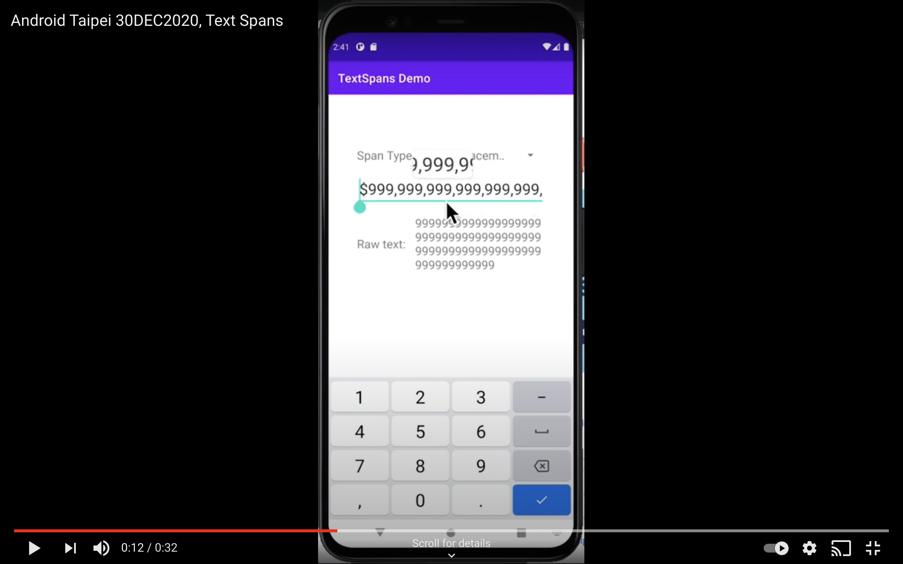

# Monetary Span

<p align="center">
    <a href="https://youtu.be/qoQfCuLKHZw">
        
    </a>
</p>

Formatting number with currency symbol and thousand separators is quite common, and it's tricky to implement it. Popular answer on StackOverlow with pure TextWatcher isn't really satisfactory and has many potential side-effects.

Android provides more than 20 span types and Span is a way to change the rendering for the text without touching the text. i.e. Span implementation changes the UI NOT data.

---

## Basic Usage

```
// Add the watcher that inserts monetary span to your TextView.
val watcher = MonetaryCharWatcherImpl(locale, currencyCode)
textView.addTextChangedListener(watcher)

// Remove the watcher.
textView.removeTextChangedListener(watcher)
```

## Advance Usage

I'm a big fan of Reactive pattern so I also implement a rx-wrapper for automatic disposing.

```
MonetaryTextWatcher
    .applyTextView(
        textView = binding.monetaryTextInput,
        locale = Locale.getDefault(),
        currencyCode = "USD", // or JPY
        isAnnotatingCharByChar = true
    )
    .subscribe()
    .addTo(disposables)
```

---

### Reference

This is a demo project for a talk in Android Taipei meetup. The original slide is [here](https://slides.com/boyw165/android-taipei-25dec2020-monetary-spans).

- Google Android advocate's article, [link](medium.com/androiddevelopers/underspanding-spans-1b91008b97e4).
- Android official Spans docs, [link](developer.android.com/guide/topics/text/spans).
- SPAN_INCLUSIVE / EXCLUSIVE, [link](developer.android.com/reference/android/text/Spanned#SPAN_EXCLUSIVE_INCLUSIVE).